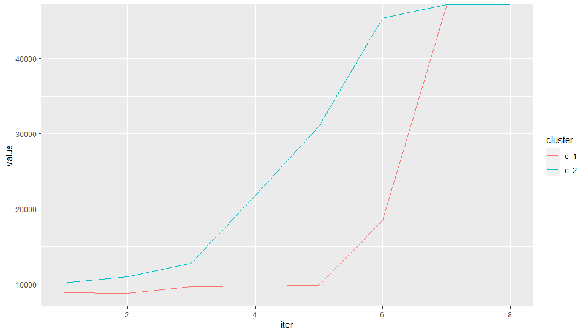
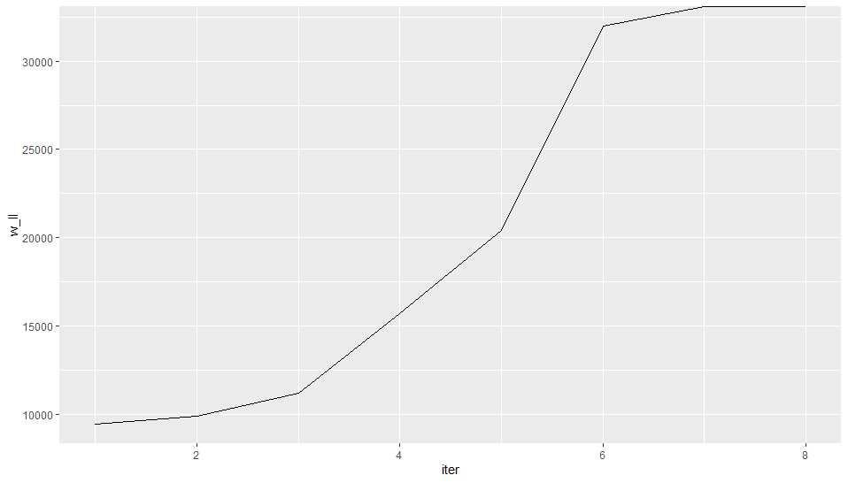
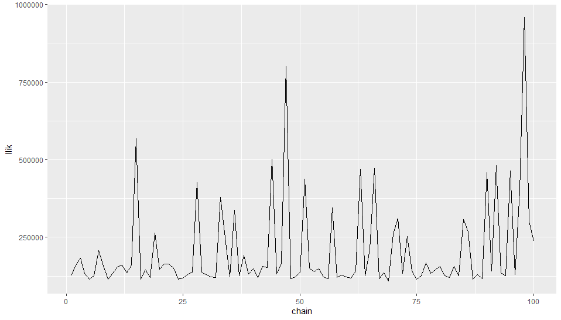
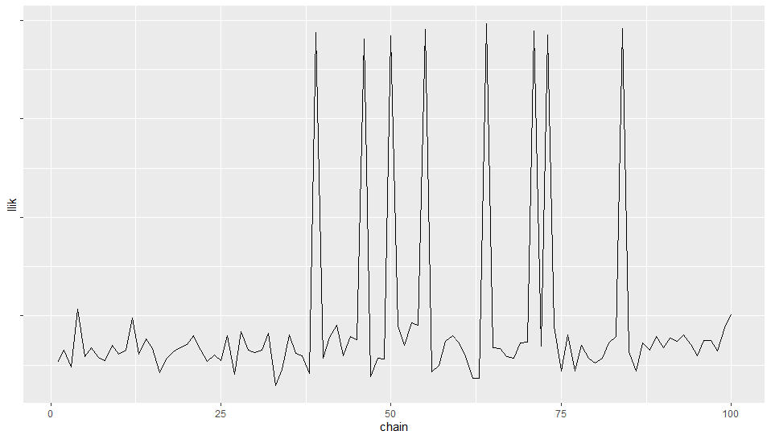

```{r setup, include=FALSE}
library(dplyr)
knitr::opts_chunk$set(echo = FALSE)
```

## Idea

Goal: Correctly cluster observations & regress in high dimensional $X$ & $Y$.

* $Y_{n \times q}$ Matrix of responses
* $X_{n \times p}$ Design matrix
* $A_{p \times q}$ Coefficient matrix (sparse in p)
* $k$ clusters


$$
f\left(\boldsymbol{y}_{i} \mid \boldsymbol{x}_{\boldsymbol{i}} ; \boldsymbol{\theta}\right)=\Sigma_{k=1}^{K} \pi_{k} \mathcal{N}_{q}\left(\boldsymbol{y}_{\boldsymbol{i}} ; \boldsymbol{x}_{\boldsymbol{i}} A_{k}, \Sigma_{k}\right)
$$

* Parameter space $\theta=\{\pi_k,A_k,\Sigma_k;k=1\ldots K \}$ solved by general EM using SARRS to compute $A_k$.

## SARRS


## HTH Mixture Algorithm

* Initialize: $\pi_k^{(0)}=\frac{n_k^{(0)}}{n}$
* Randomly initialize observations into k clusters

While not converged ($m=1,\ldots, M$) do:

* for $k=1,\ldots,K$ apply SARRS on all observations in $C_k^{(m-1)}$ to obtain $A_k^{(m)}$, $\Sigma_k^{(m)}$
* compute $\mu_{ik}^{(m)} = \mathcal{N}_{p}\left(\boldsymbol{y}_{\boldsymbol{i}} ; A_{k}^{(m)} \boldsymbol{x}_{\boldsymbol{i}}, \Sigma_{k}^{(m)}\right)$
* $C_k^{(m)}=\{i|\text{ML component k} \}$
* $\pi_k^{(m)}=\frac{n_k^{(m)}}{n}$

## HTH Mixture Algorithm

* Empirically, HTH Mixture reaches local maximum quickly
* Need to determine method for efficiently exploring the likelihood space with different random initialization.

## Likelihood Space Exploration Idea 1

* Mimic the idea of chains from MCMC
* In parallel, run large number of chains and select the one which reaches the largest likelihood.
* This method works well, although not the most efficient way to explore the space.

## Likelihood Space Exploration Idea 2

* To more efficiently explore the space, when a local maximum is reached, perturb the initialized state by a proportion $p$ (e.g. $20\%$) and rerun. 

## Data Simulation

* $X_k$ consists of iid random vectors sample from $MVN(\mathbf{0},\Sigma_k)$ 
* $\Sigma_k$ diagonal
* Noise matrix $Z_k \in \mathbb{R}^{n \times q}$ has iid $N(0,\sigma^2)$ entries
* $A_k=\left(\begin{array}{c}b_k B_{0_k} B_{1_k} \\0\end{array}\right)$
  - with $b>0$, $B_0 \in \mathbb{R}^{s \times r}$, $B_1 \in \mathbb{R}^{r \times q}$
* $Y_k = X_kA_k+Z_k$

Finally, combine $X$ & $Y$

## Results

* HTH algorithm consistently reaches local maximum


## Results




## Results

* Idea 1 $\rightarrow$ random initialization each time



## Results

* Idea 2 $\rightarrow$ perturb local maximum
* Appears to be more efficient


## Results

* Hello?


## Performance

* In simulated data, current algorithm clusters well (perfectly in most cases given enough chains)

* Challenges:
  - Likelihood space is explored inefficiently, sometimes requires large number of chains
  - Computationally cumbersome/inefficient
  

